# Problem definition
Our task is to detect objects in images. Because this problem is complex, we simplified it by not taking object type into account. We are predicting only bounding boxes of people in images.

# Architecture

For solving task of object detection, we used approach known as YOLO. It is an approach based on splitting image into a grid and then making prediction for each grid. Advantage of this approach is that it can predict objects in entire image in one passing of the image.

## Base model

Architecture of our base model is based on Convolutional Neural Networks (CNNs). We use this type of neural networks beacuse we work with images and CNNs are designed to operate on images. As we can see from <em>Fig. 1</em> our model consists of 4 convolutional layers and 2 fully connected layers. Convolutional layers are used for feature extraction. Fully connected layers are used for operating on these features and making predictions. Activation function is ReLU on each layer except for the last layer where is sigmoid. We used sigmoid because outputs have to be between 0.0 and 1.0.
<figure>

    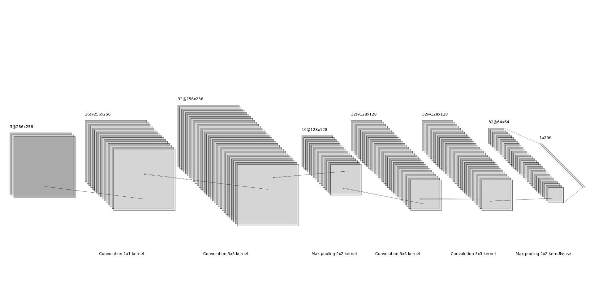
    <figcaption><small>Fig.1: Model used for object detection. Due to readability we did not put the last fully connected layer to the figure. This layer is very wide and thus the figure would not be readable.</small></figcaption>

</figure>

Our base model has poor performance as we can see in the section **Experiments**. Base model is small and is not able to overfit on 1,000 images. In the next steps we plan to extend the model with additional convolution layers to get better feature extractor. We also plan to use fully convolutional architecture based on Darknet-19 [1] model.

## Darknet19

Architecture of Darknet19 is also based on CNNs. Basic version of this model consists of 22 convolutional layers. After each layer there is LeakyReLU activation function and batch normalization. In our case, we used one dense layer at the end with sigmoid activation and 845 neurons (13 * 13 * 5 where 13 * 13 is from grid size and 5 is size of YOLO vector). This model also contains passthrough layer from 13th layer to 22nd layer.

<figure>

    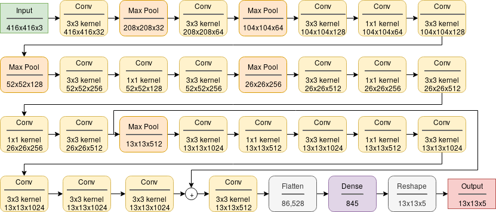
    <figcaption><small>Fig.2: Darknet model we used.</small></figcaption>

</figure>

## Resnet

Architecture of our Resnet consists of two convolutional layers, followed by max pooling and then of multiple blocks of four convolution layers followed by max pooling. After every second convolutional layer is skip connection. Last layer is same as in Darknet19, which is dense layer with 845 neurons.

<figure>

    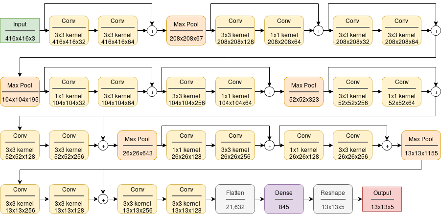
    <figcaption><small>Fig.3: Resnet model we used.</small></figcaption>

</figure>

# Infrastructure

## Logging of results

We use TensorBoard for logging. To monitor long training runs we log values of loss and metric for both train and validation dataset. Each value is logged at the end of the epoch. We also log hyperparameters and the best value of loss and metric. The hyperparameters that are logged are batch size, number of epochs, lambda coordinate, lambda no object and learning rate. These values are logged at the end of the training.

## Saving of models

In order to keep trained models we utilize model saving. During training we are saving weights of the best model based on a value of validation loss.

## Evaluation

### Loss function

We used YOLO loss function from [2] and motified it to our needs. This loss function is composed of multiple parts. First part represents loss of bounding box center compared to true bounding box center.
<figure>

    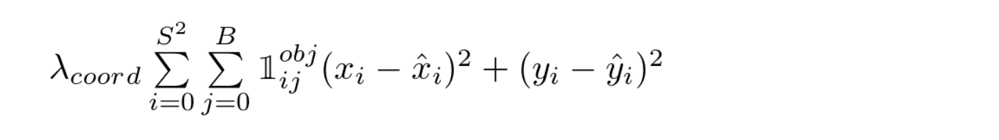
    <figcaption><small>Fig.4: Loss on center of predicted bounding box.</small></figcaption>

</figure>

Second part represents loss of width and height compared to true bounding box width and height.
<figure>

    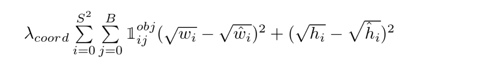
    <figcaption><small>Fig.5: Loss on width and height of predicted bounding box.</small></figcaption>

</figure>

Third part represents loss of prediction when there is object inside true bounding box (first part) and when then there is no object inside true bounding box (second part).
<figure>

    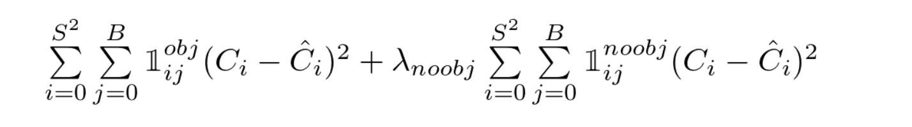
    <figcaption><small>Fig.6: Loss on confidence of predicted bounding box.</small></figcaption>

</figure>

Fourth part represents loss of misclassification of object inside predicted bounding box compared to true bounding box. We have not implemented this part yet, because we are currently only focusing on correct bounding box and confidence predictions.
<figure>

    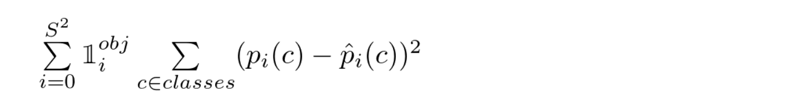
    <figcaption><small>Fig.7: Loss on predicted category of object.</small></figcaption>

</figure>

### Metrics

We are using **F1 score** for evaluating how good is our model. In order to calculate **F1 score** we need to know how many **true positives (TP)**, **false positives (FP)** and **false negatives (FN)** our model predicted.

Here are our definitions of **TP**, **FP** and **FN**:

 - **TP:** all predicted bounding boxes where IoU (Intersect over Union) is greater than threshold and there is some object in predicted bounding box
 - **FN:** all predicted bounding boxes where IoU (Intersect over Union) is lower than threshold and there is some object in predicted bounding box
 - **FP:** all predicted bounding boxes where IoU (Intersect over Union) is greater than threshold and there is no object in predicted bounding box

We also plan to use metric **Mean Average Precision**, however out implementation is currently not working correctly.

# Data

We used data from MS COCO 2017 challenge [3]. We used 1000 images for training and 100 images for validation.

## Data loading

For loading images and their annotations we used COCO API available at [4]. After loading images and annotaions, we compressed them into one .npz file by using function **compress_coco** from file **scripts/compress_coco.py**. When we use images for analysis or training, we load them from .npz file.

Before compressing images, it is possible to choose how many images will be compressed (and therefore used later) and with which categories of objects. It is also possible to save resized images in order to save disk space.

Compressed images and annotations are loaded by using function **load_dataset** from **src/data/load_data.py**. This function simply loads .npz file and reads image and annotaion data from it.

We use tensorflow Dataset API for data pipeline to create dataset which is input to model training.

## Image preprocessing

### Resizing of images

Images from MS COCO dataset are of various sizes. To be able to use them as input to neural network we had to resize all images to constant shape. We decided to use shape 256 * 256 pixels, because in dataset there are portrait and landscape images. For changing their shape, we simply stretched image dimension if it was smaller than 256 pixels or compressed it if it was larger than 256 pixels. We think that this way of resizing images is best in terms of not loosing information present in original image. Resizing of images was done using **tensorflow** function **resize** in function **resize_images** from file **src/data/preprocessing.py**.

We could also use padding and cropping of image, but we chose resizing of images, because padding would introduce line at the edge of images, which could be understood as part of object by neural network. Cropping of images could result in losing parts of objects, or even entire objects and therefore decrease amount of objects on which our network could train.

### Scaling of pixel values

Because neural networks are sensitive to values of input data, we scaled all pixel values to interval <0.0, 1.0>. This results in smaller differences between pixel values and therefore network is able to learn more accurately, because all pixels are considered as more equal compared to unscaled pixel values.

## Annotations preprocessing

Original MS COCO annotations contained various information as bounding boxes, image id, category id, annotation id, etc. However, we use only bounding boxes, image id and later we will use category id. To be able to use these annotations with YOLO method for object detection, we processed these annotations into YOLO vectors.

### YOLO vector

YOLO vector comprises of multiple different values. First value represents confidence that there is some object inside of the bounding box. Second (**x**) and third (**y**) values represent coordinates of center of bounding box. These coordinates are scaled relative to the grid cell according to position of center of bounding box inside of the grid cell. Fourth and fifth values represent width and height of bounding box relative to size of image.

# Experiments

We performed series of experiments for all models. In this section we will describe all of them.

## Training routine

Our training routine consists of setting up a model. Then we run an experiment. After the experiment ends, we evaluate results and decide whether we change hyperparameters or model. Then we run experiment again.

## Base model
In this section we describe our experiments with base model.

### Sanity check

First two performed experiments were sanity checks. We did these experiments to check if our implementation is correct and can be used for task of object detection.

In first experiment we trained our model on 1 image for 100 epochs to see if it can overfit. This was dane in order to ensure that our preprocessing and postprocessing is correct.

In second experiment we trained our model on 100 images for 100 epochs. This experiment was done to see whether our model is able to learn multiple images.

<figure>

    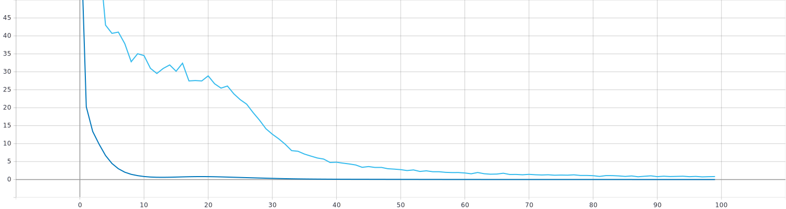
    <figcaption><small>Fig.8: Loss on 1 image (dark blue) and 100 images (light blue).</small></figcaption>

</figure>

<figure>

    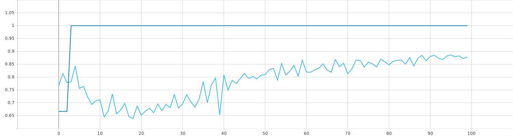
    <figcaption><small>Fig.9: F1 score for 1 image (dark blue) and 100 images (light blue).</small></figcaption>

</figure>

As we can see see from figures, our model was able to overfit one image after 3 epochs, however for 100 images it did not overfit even after 100 epochs, but F1 score is high so it managed to learn most of the images.

Both experiments are in jupyter notebook **notebooks/sanity_check.ipynb**.

### Large experiment

In this experiment we used 1000 images for training and 100 for validation and trained for 50 epochs. We did this experiment to see whether our model is large enough to learn to detect people in images. In Fig.10 we can see loss function for train (red) and validation (blue) dataset. In Fig.11 we can see F1 score for train (red) and validation (blue) dataset.

<figure>

    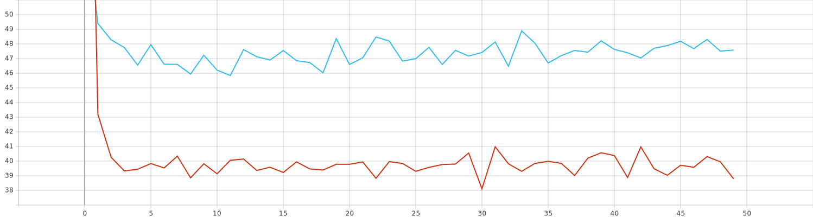
    <figcaption><small>Fig.10: Loss on train (red) and valid (blue).</small></figcaption>

</figure>

<figure>

    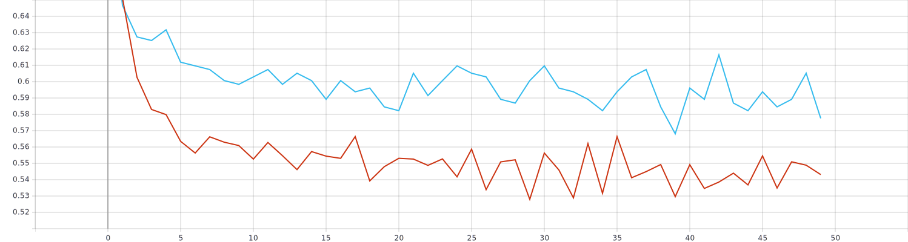
    <figcaption><small>Fig.11: F1 score on train (red) and valid (blue).</small></figcaption>

</figure>

As we can see from images, our model is too small to learn 1000 images. Therefore, we will add some layers to our model to see if it will be able to better learn those images.

What is curious is that F1 score was steadily decreasing after each epoch. There might be error in our metric, but it can also be caused because our model tried to learn some features of people, however it was too small to learn all features that were present in those 1000 images and as a result it learned something, but nothing properly and therefore it performed poorly.

## Darknet19
In this section we describe our experiments with Darknet19 model.

### Sanity check

For sanity check we have done three experiments. In first experiment, we trained our model to overfit on 1 image for 100 epochs. We were able overfit quite good, however our model predicted two bounding boxes in images and only one is truly present.

In second experiment we trained our model on 10 images for 100 epochs. Trained model highly overfitted on those 10 images, only small inaccuracies in predictions on those same images were present.

In third experiment we trained our model on 100 images for 100 epochs. Loss was a lot higher compared to second experiment for Darknet19 and therefore our model was not so accurate.

It was complicated to set hyperparameters correctly. We had to try many combinations of hyperparameters until we obtained model, which learned something and did not di(e)verge. We had to use very small learning rate (10e-6) and momentum of batch normalization was 0.9 because of small size of training set.

It is important to note that for large experiment we added dense layer at the end of model. therefore it would probably perform better in sanity checks, however it was not needed.

All sanity checks are in jupyter notebook **notebooks/sanity_check.ipynb**.

### Large experiment

In this experiment we used 1000 images for training and 100 for validation and trained for 100 epochs. We did this experiment to see whether our model is large enough to learn to detect people in images. In Fig.12 we can see loss function for train (blue) and validation (red) dataset. In Fig.13 we can see F1 score for train (blue) and validation (red) dataset.

Because training set was larger than in sanity check, we changed batch normalization's momentum to 0.99.

<figure>

    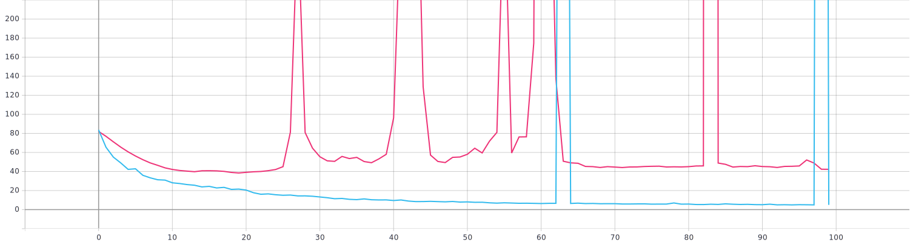
    <figcaption><small>Fig.12: Loss on train (blue) and valid (red).</small></figcaption>

</figure>

<figure>

    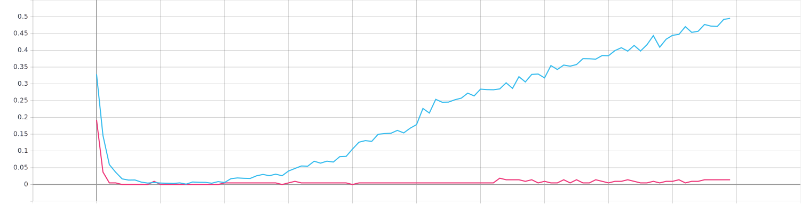
    <figcaption><small>Fig.13: F1 score on train (blue) and valid (red).</small></figcaption>

</figure>

As we can see, loss on train dataset steadily decreased, except for two spikes, where it was quite high however it decreased again. Smallest loss achieved was in 95th epoch, where loss on train was 4.957. However, on validation dataset, smallest loss was in 19th step and then it increased with a lot of spikes, which are probably result of overfitting on train data in combination with probably weird images in validation data.

F1 score was increasing for training dataset since 20th epoch. For validation dataset it was near or equal to zero during whole training. We conclude from this that our model started to overfit on training data, what is supported by logs of loss function described in previous paragraph and in Fig.12.

## Resnet
In this section we describe our experiments with Resnet model.

### Sanity check

Sanity check for this model was not performed.

### Large experiment with 1000 images

In this experiment we used 1000 images for training and 100 for validation and trained for 35 epochs. We did this experiment to see whether our model performs better compared to Darknet19. In Fig.14 we can see loss function for train (orange) and validation (dark blue) dataset for residual model. In Fig.15 we can see F1 score for train (orange) and validation (dark blue) dataset. Other lines are same as in Fig.12 and Fig.13.

We used same hyperparameters as for Darknet19.

<figure>

    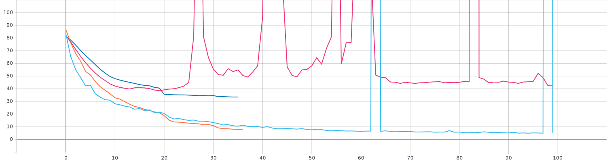
    <figcaption><small>Fig.14: Loss on train (orange) and valid (dark blue).</small></figcaption>

</figure>

<figure>

    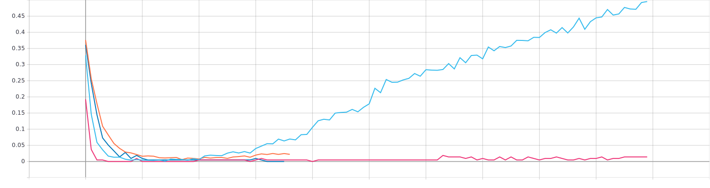
    <figcaption><small>Fig.15: F1 score on train (orange) and valid (dark blue).</small></figcaption>

</figure>

We can see that from the beginning, residual model performed slightly worse, but around 18th epoch outperformed Darknet19. Also validation loss steadily decreased, indicating that in this case, our model did not overfit on training data. F1 score also shows that there was no overfitting.

<figure>

    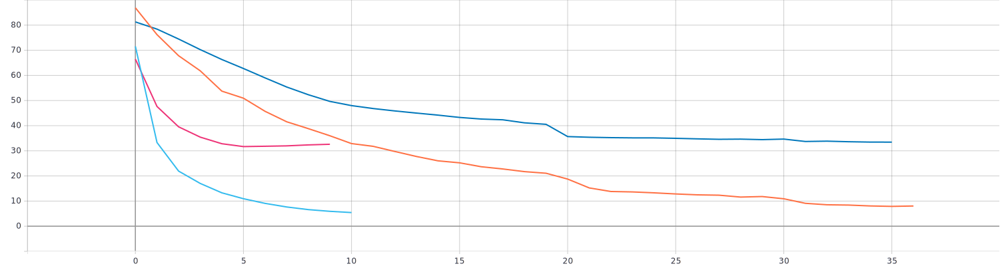
    <figcaption><small>Fig.16: Loss on train (orange, blue) and valid (dark blue, red).</small></figcaption>

</figure>
In this experiment we used learning rate equal to 10e-5. As we can see from Fig.16 it improved speed of learning but model overfitted sooner.

### Large experiment with 10000 images
We ran two experiments, one with learning rate equal to 10e-6 and one with learning rate equal to 10e-5. Those experiments are shown in figures below.
<figure>

    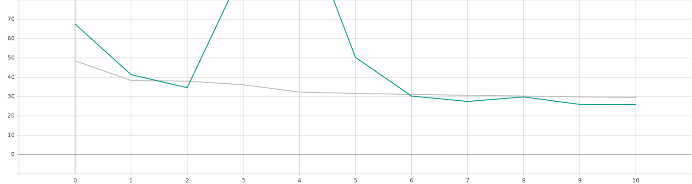
    <figcaption><small>Fig.17: Loss on train (green) and valid (grey) with learning rate equal to 10e-6.</small></figcaption>

</figure>
<figure>

    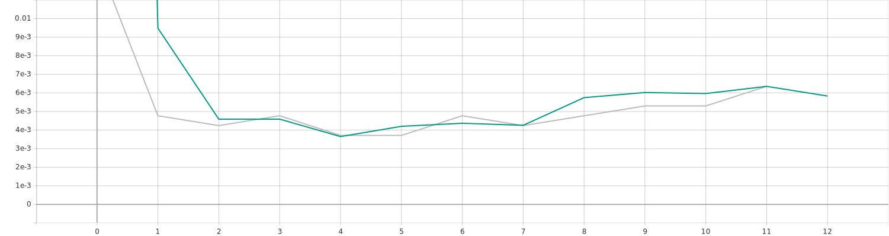
    <figcaption><small>Fig.18: F1 score on train (green) and valid (grey) with learning rate equal to 10e-6.</small></figcaption>

</figure>
In first experiment with smaller learning rate our model was learning very slowly, however it did not show any signs of overfitting. In Fig.17 we can see weird spike in loss, but we are not sure what caused it.

<figure>

    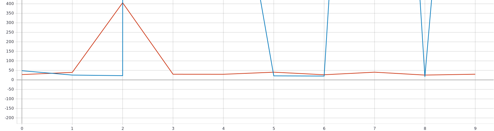
    <figcaption><small>Fig.19: Loss on train (green) and valid (grey) with learning rate equal to 10e-5.</small></figcaption>

</figure>
<figure>

    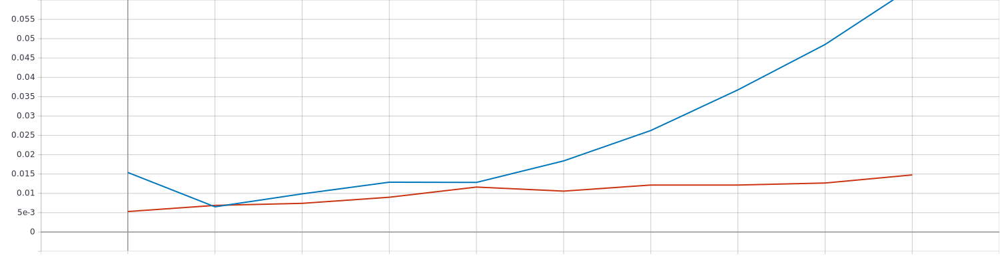
    <figcaption><small>Fig.20: F1 score on train (green) and valid (grey) with learning rate equal to 10e-5.</small></figcaption>

</figure>
As we can see in Fig.19, our model has massive fluctuations which are caused by larger learning rate compared to previous experiment.

# Evaluation of experiments
We performed many experiments with various models and optimized their hyperparameters by hand. We were able to overfit models, however we were not able to obtain model able to detect people in previously unseen images.

When training on 1000 images, we were able to overfit. We conclude from this that model was large enough for this problem.

We experienced weird spikes when training with 10000 examples. It could have been caused by learning rate, because those spikes were more frequent when learning rate was larger. However, such small learning rate resulted into very slow learning of model. Scheduling of learning rate could help in this situation. It is also possible that we have some bugs in the loss function.

Main hyperparameter we tried to optimize was learning rate. Our loss function is highly dependent on its lambda hyperparameters and therefore problems we encountered during training might have been caused by bad settings of lambda hyperparameters.

# Conclusion
We created infrastructure of deep learning project. We focused on data loading, logging of results, saving of models during training, etc.

We also created custom YOLO loss function which was non-trivial. We tried to implement Mean Average Precision metric, but we were not successful, because it was complex in TensorFlow. Therefore we implemented custom F1 score metric, which is probably also bad.

We created baseline model for object detection task and verified it by sanity checks. Then we run one larger experiment, where we discovered that our model does not have large enough capacity to perform well on training dataset not even close to generalize well on validation dataset.

We implemented Darknet-19 model, which was used in YOLO9000 [1]. We were able to overfit slightly on 1000 images after exhausting optimization of hyperparameters.

Best model we created was Resnet with 22 convolutional layers and one dense layer at the end. This model performed better than other models. However, we were not able to train it to detect people in images which were previously unseen.

Models were very sensitive to hyperparameter settings. Therefore we tried to optimize them manually. Our main focus was optimization of learning rate, as it had largest influence on our models. Optimization of more hyperparameters could have improved results, however we were limited by time.

# References

[1] https://pjreddie.com/media/files/papers/YOLO9000.pdf

[2] https://github.com/ecaradec/humble-yolo

[3] http://cocodataset.org/#home

[4] https://github.com/cocodataset/cocoapi